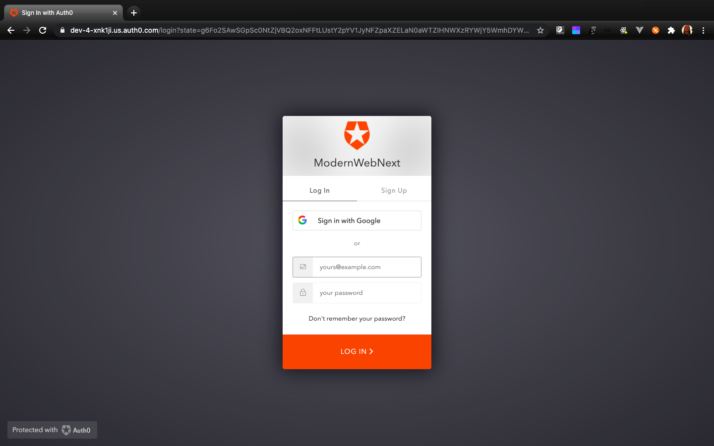
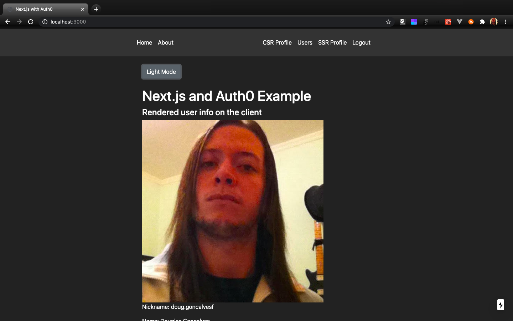

<h1 align="center">
     Desafio Modern Web - NextJS/Auth0
</h1>

 

   <a href="#-tecnologias">Tecnologias</a>&nbsp;&nbsp;&nbsp;|&nbsp;&nbsp;&nbsp;
   <a href="#-projeto">Projeto</a>&nbsp;&nbsp;&nbsp;&nbsp;&nbsp;&nbsp;
 

 

    
  
 

 ## :rocket: Tecnologias

 This project was developed using the following technologies:

 - [NextJS](https://nextjs.org)
 - [Auth0](https://auth0.com)

 ## 💻 Projeto
    Autenticação por login social via Auth0 em uma aplicação NextJS

 -- Quer ver uma versão funcional  ? [Vercel](https://modernweb-auth0.vercel.app)

 ---
<h4 align="center">
   Code and coffee ☕
</h4>
